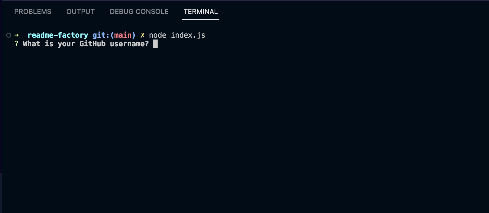
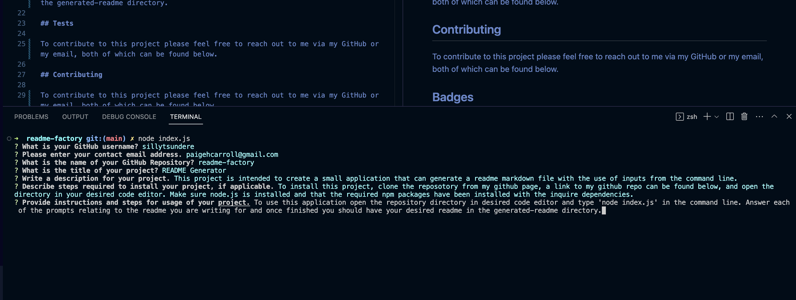
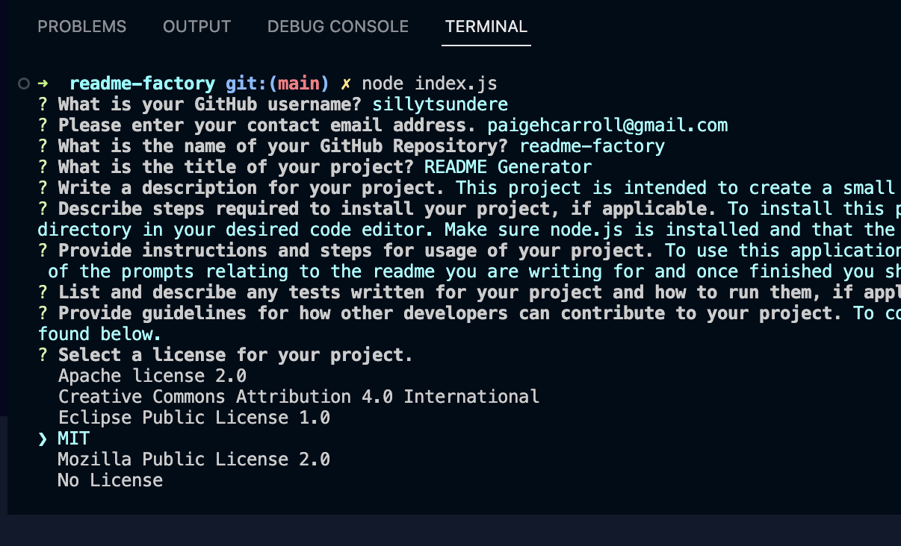
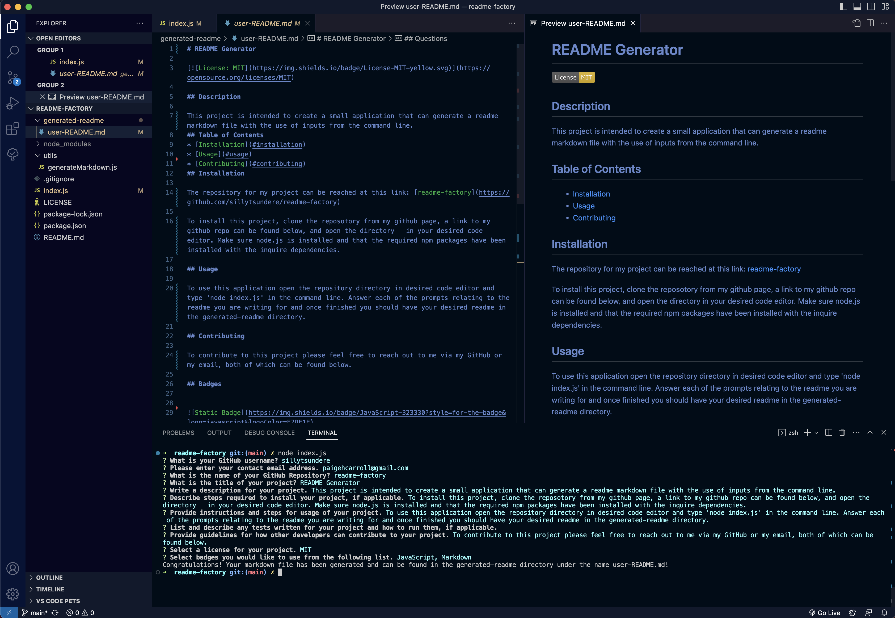

# README Generator

## Description

This project is intended to create an app that one can use to quickly and easily generate a README.md file from their command line. The main goal of this project was to gain first-hand practice with node.js. Javascript code utilizes node inquirer methods to prompt the user and vanilla JavaScript constructs a string from those responses to be written to a markdown file. Experimenting how node utilizes Javascript and how JavaScript can be utilized outside of a browser was a large portion of this project. This project helped me more deeply understand Node.js and its npm packages with their wide range of abilities and utilities.

## Installation

To run the code, clone the project directories and files from [the repository](https://github.com/sillytsundere/readme-factory) and open the JavaScript files in preferred code editor. The code can be run from the command line with the assitance of Node.js. Once Node.js is installed with the inquire npm package, the program can be utilized to generate a desired README.

## Usage

Navigate to the directory of the index.js file and input the node command to initiate the inquire prompts, 'node index.js'. Once started you will be presented with several questions asking about the project for which you are generating a README file; answer all applicable questions. 

Once completed the markdown file will be generated in the 'generated-readme' directory under the name 'user-README.md.' 

## Credits

Source code was obtained from [The Coding Bootcamp](https://github.com/coding-boot-camp/potential-enigma)

Badges sourced from: [Awesome Badges](https://dev.to/envoy_/150-badges-for-github-pnk)

## Badges

## License

MIT License

## How to Contribute